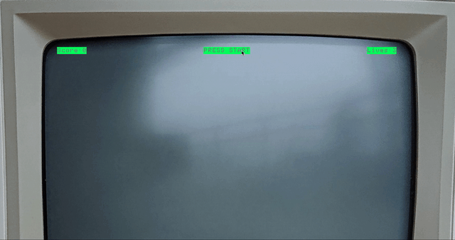
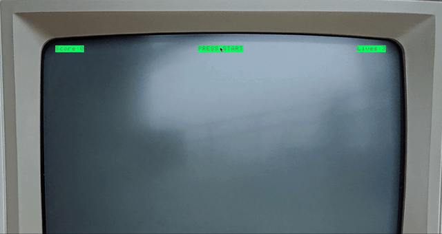
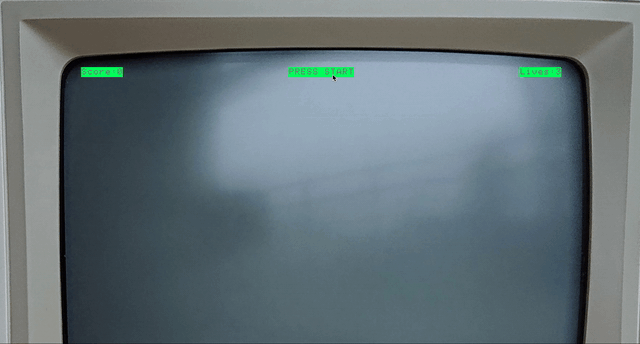
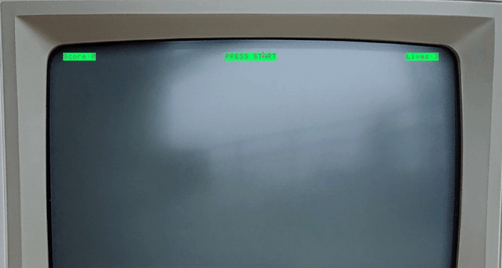

#  Software Engineering Immersive Project #1: Space Invaders

Project 1 by:  Cliff Conolly

---


## Overview:

Space Invaders is a 1978 arcade game and one of the first of its kind of  the shoot’em up genre. The goal is to defeat wave after wave of descending aliens with a horizontally moving laser to earn as many points as possible. Occasionally, an alien mother-ship will go randomly from left or right or vice versa across the top of the screen. This version is a Star Wars theme, and was my first project at General Assembly and quickly became a passion project for me.

The player controls the movement of the spaceship (X-Wing Fighter) in order to kill the enemy ships (Tie-Fighters) which are approaching closer as the game goes on.

---

## Timeframe:

1 week (June 2019)

---

## Technologies used:
* JavaScript (ES6)
* HTML5
* CSS
* Git
* GitHub
* Google Fonts

---


## Game Instructions:
- 1.	The game is started by clicking on the "PRESS START" button.


- 2.	Once the game starts, the enemy Tie-Fighters will start to shoot down blasts which you will have to maneuver to get out of the way.


- 3. As you maneuver left to right, press the space-bar to fire your missiles to kill the ships.




- 4. When you have a kill on the enemy ship you will see and hear it explode and 10 points will be added to your score.


- 5. When the enemy kills you, you will also explode and one of your lives will be deducted and you will immediately receive a new ship.




- 6. When all of your ships have been hit, the game will be over.



---

## Process:

#### Grid Layout & Generation of objects on screen:

The starting point for this game was creating the basic grid layout on which the dogfight could happen between the player and enemies and where they could move. This was created by a list of 'div's in the HTML. Each cell within the grid was an individual element. These cells are nestled within a container. The X-Wing and Tie-Fighters along with the other images for the blasters and explosions were images that I found on a website that uses photorealistic images that you can rotate in any direction to get the angle you want. Therefore, I aligned the fighters at an angle to make it appear more 3 dimensional and realistic as they face off.

---

## Functionality:

#### Controls:
* Spaceship (X-Wing Fighter): ←  →  keys
* Start game: Pressing "PRESS START" at top.
* End game: Game ends after all ships are killed (“End Button” will be added in future upgrades)
* Command(CMND) R to RESET game.

Functions for every aspect included the firing and movement of the missiles by both the player and the enemy, score keeping, lives and game over. The biggest function (and most difficult) was the movement of the enemies as they came down closer to the player, dropping one level and firing at the same time.

#### Missile Hits:


###### Enemy Explosion
To determine when an enemy was killed, the enemy ship and missile fired from the X-Wing fighter had to occupy the same index in the grid. Upon contact the explosion audio would sound, the enemy ship would be removed, and the image of the explosion would be visible for a half second to simulate disappearing.

```
const explode1 = document.querySelector('explosion')
function enemyXplosion(e) {
  const hit = document.querySelector('#hit')

  if (missileIndex === enemyOneIndex) {
    const position = missileIndex
    clearInterval(enemyOneIntervalId)
    enemyOneIndex = null
    hit.play()
    squares[position].classList.remove('enemy')
    squares[position].classList.add('explosion')
    setTimeout( ()=> {
      squares[position].classList.remove('explosion')
      add10()

    }, 500)
  }
}

```


###### Player Explosion:

The player explosion when hit had the same fundamental function as the enemy explosion. With the exception that the player and the enemy bomb had to occupy the same index in the grid.

```
const playerExplode = document.querySelector('explosion')
function playerXplosion(e) {
  const xhit = document.querySelector('#xhit')

  if (bombIndex === playerIndex) {
    const position1 = bombIndex
    clearInterval(playerIntervalID)
    playerIndex = 210
    const xHit =
    xhit.play()
    squares[position1].classList.remove('player')
    squares[position1].classList.add('explosion')
    setTimeout( ()=> {
      squares[position1].classList.remove('explosion')
    }, 500)
    console.log('playerIndex', playerIndex)
    console.log('squares[playerIndex]', squares[playerIndex])
    minusLife()
    squares[playerIndex].classList.add('player')
  }
}

```

#### Key Press for Firing and Movement:
The player has to manoevre from left to right on the screen and fire missiles up to the enemies. Eventlisteners were added on keydowns so that the when the Space Bar was hit, it initiated the keycode 32 and fired a missile.

###### Firing:
```
function fireMissile(e){
  const shootBlast = document.querySelector('#blaster')

  if (e.keyCode === 32 && !laser) {
    laser = true
    shootBlast.play()
    missileIndex = playerIndex -20
    missileInterval = setInterval(moveMissile, 150)
}
```

```
document.addEventListener('keydown', fireMissile)

squares[playerIndex].classList.add('player')
window.addEventListener('keydown', handleKeyDown)
```
###### Movement:
Also when the left and right arrows were 'keydowned' they initiated the keycodes 37 and 39 respectively, which would perform the function of movement for the player.

```
function movePlayer() {
  squares.forEach(square => square.classList.remove('player'))
  squares[playerIndex].classList.add('player')
}

function handleKeyDown(e) {
  let playerShouldMove = true
  switch(e.keyCode) {
    case 39:
      if (playerIndex % width < width - 1) {
        playerIndex++
      }
      break
    case 37:
      if (playerIndex % width > 0) {
        playerIndex--
      }
      break
    default:
      playerShouldMove = false
  }
  if (playerShouldMove) movePlayer()
}

```


#### Audio:
Original sound files for the blasters from Star Wars for the respective X-Wing and Tie-Fighters were also used to simulate when they fired and also when they exploded from a missile hit.

---

## Challenges:
The biggest challenge was trying to get multiple (tie-fighter) ships. It was only in hindsight that I should have used classes to accomplish this. The code I wrote for my first enemy ship could be duplicated, and I did it for a second ship but the code got buggier when I tried a third.

---


## Wins:

The most satisfying moment was when I reverse engineered the player firing function (upward) and used it for the enemies to shoot in the opposite direction (downward). Upon testing it, there were only two lines of code that were needed to fix the interval at which the enemy fired, and it ‘worked’! I was amazed because it was a surgical operation that took 1 ½ hours to do and that was the only bug for that function.

---

## Bugs:

When the first Tie-Fighter is shot and destroyed, there is a bug that is causing bombs to be dropped on the left of the screen continuously and appears to come out of nowhere. This is the first issue to fix as soon as I start tackling the upgrade.



---


## Future features:

Future iterations will include more enemy ships, and a Star Destroyer as the ‘mothership’; as it enters onto the screen the 'Empire Theme' will play.  Also now that I can manoeuver the photorealistic images in different directions I will have an effect whereby any shot that clips a Tie-Fighter, will make it ‘appear’ to spin out of control towards the X-Wing Fighter and increase the difficulty level whereby the player has another object to escape from.

#### Live site: https://cliff-conolly.github.io/sei-project-1/
